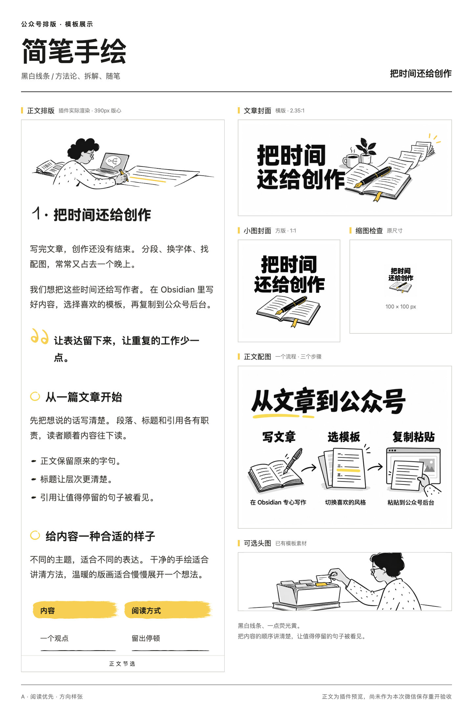
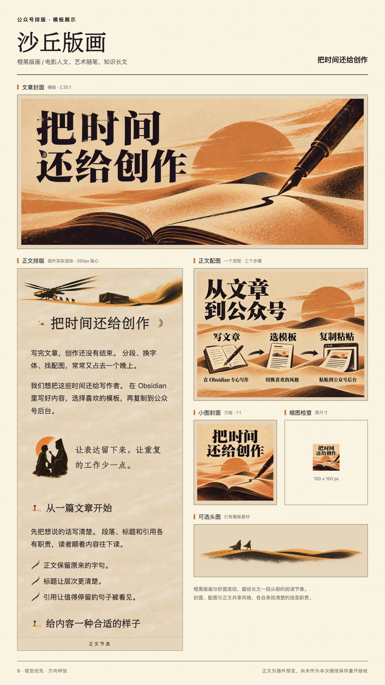

把这句话发给你的 Agent：请按 https://github.com/cfwy-ai/obsidian-wechat-mp/blob/main/plugin/docs/1.%20安装.md 安装公众号排版插件；先检查 Obsidian，再问清并确认目标 Vault，保留已有配置，安装后核对 10 套模板。

# 长风 · 公众号排版

**把时间还给创作。**

在 Obsidian 写文章，选择模板，点击「复制图文」，粘贴到微信公众号后台。
内置 10 套模板，支持手机预览、文章头图和长图导出。
普通安装不往笔记目录添加模板文件，也不需要配置 AppID 或 AppSecret。

---

## 开始使用

1. [安装插件](plugin/docs/1.%20安装.md)：Obsidian 1.8.0+，仅桌面端。
2. 打开一篇文章，点击侧栏排版按钮。
3. 选择模板，复制到公众号，检查后发布。

公众号保存后的效果仍需检查，尤其是表格、图片和手机深色模式。
插件不自动发布文章。

---

## 三个入口

| 目录 | 内容 |
| --- | --- |
| [plugin](plugin/) | 插件源码、安装与版本发布 |
| [templates](templates/) | 10 套可分发模板与视觉规范 |
| [skills](skills/) | 文章排版、封面与配图两个 Agent Skill |

[查看两张视觉样张（待确认）](templates/README.md#视觉样张待确认)。

排版 Skill 保留原文，金句使用引用。
配图 Skill 先确认模板和图片用途，再生成完整图文。

---

## 模板示例

先展示两套视觉样张，封面、配图与介绍图仍待确认。
正文来自插件实际渲染。

| 简笔手绘 | 沙丘版画 |
| --- | --- |
|  |  |

---

## 许可

插件源码采用 [MIT](LICENSE)。
模板字体遵循各自附带的许可；[字体说明](templates/README.md)有单独说明。
「简笔手绘」使用 HarmonyOS Sans 字体。
